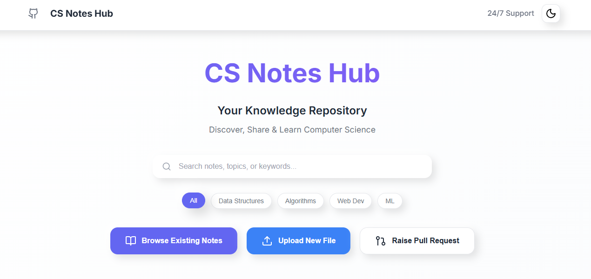
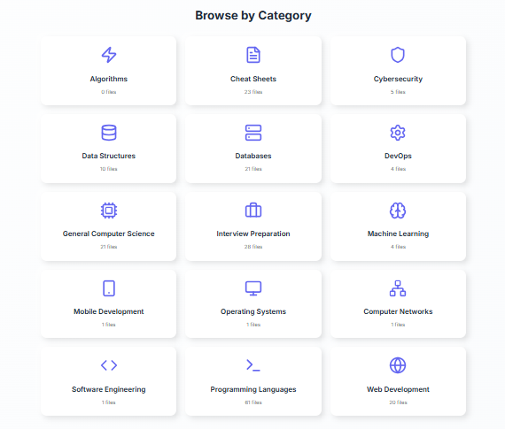
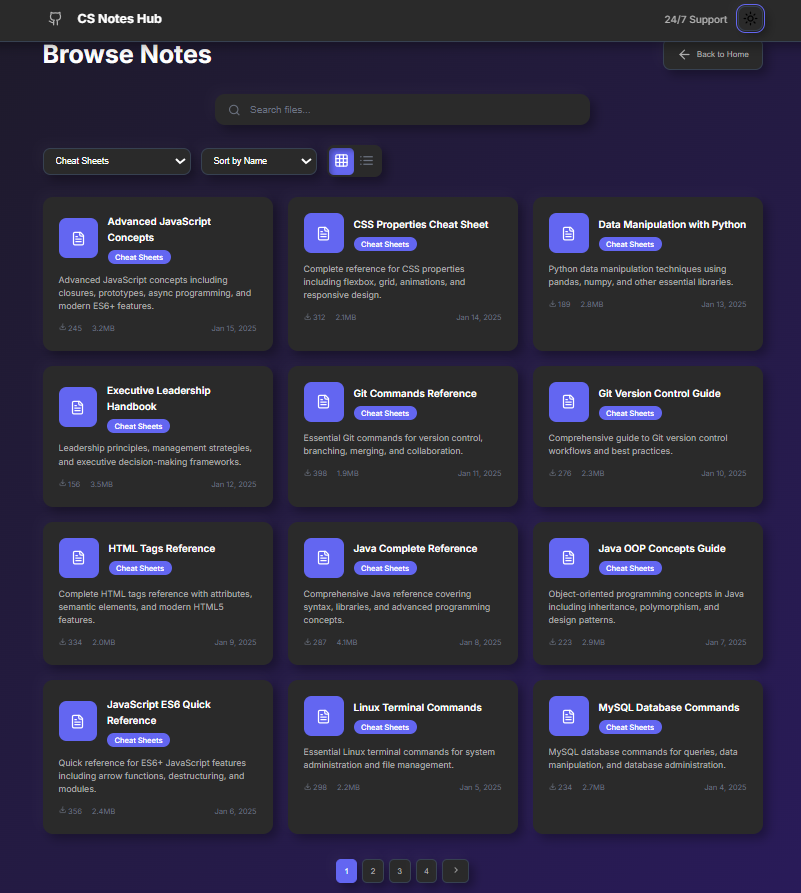
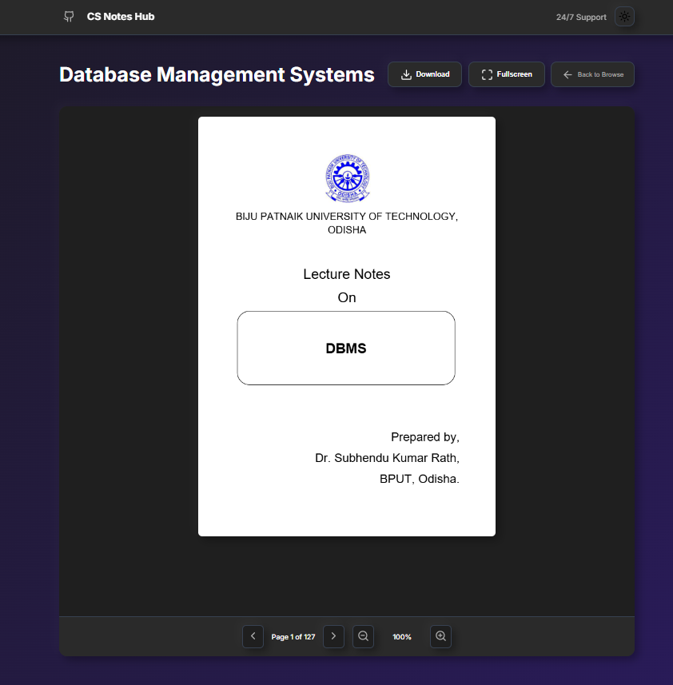

# CS Notes Hub 📚

A professional, modern platform for sharing and discovering 200+ Computer Science notes and resources. Built with vanilla JavaScript, featuring a beautiful neomorphic design with dark/light themes, real-time search, and seamless file management.


---

## 🌐 Demo  
🔗 **Live Demo**: [CS Notes Hub on Netlify](https://cs-notes-hub.netlify.app/)

### 📸 Demo Screenshots
<table>
  <tr>
    <td></td>
    <td></td>
  </tr>
  <tr>
    <td></td>
    <td></td>
  </tr>
</table>


---

## ✨ Features

### 🎨 Design & UI
- **Neomorphic Design**: Beautiful soft shadows and rounded corners
- **Dark/Light Themes**: Toggle between professional dark and light modes
- **Responsive Layout**: Mobile-first design that works on all devices
- **Smooth Animations**: Micro-interactions and hover effects
- **Professional Typography**: Clean Inter font family

### 🔍 Search & Discovery
- **Real-time Search**: Instant search across file names and descriptions
- **Advanced Filtering**: Filter by category, file type, and upload date
- **Smart Sorting**: Sort by name, date, popularity, or file size
- **Category Organization**: 10 comprehensive CS categories

### 📁 File Management
- **Drag & Drop Upload**: Intuitive file upload with progress tracking
- **Multiple Formats**: Support for PDF, DOC, DOCX, PPT, PPTX files
- **File Validation**: Size limits and type checking
- **Metadata Management**: Title, description, and category assignment

### 📖 Viewing Experience
- **PDF Viewer**: Embedded PDF viewing with PDF.js
- **Fullscreen Mode**: Distraction-free reading experience
- **Navigation Controls**: Page navigation and zoom controls
- **Download Options**: Easy file downloading

### 🚀 Performance
- **Single Page App**: Smooth navigation without page reloads
- **Service Worker**: Offline functionality and caching
- **Optimized Assets**: Compressed images and efficient loading
- **SEO Friendly**: Proper meta tags and semantic HTML

---
## 🏗️ Project Structure

```
cs-notes-hub/
├── 📄 index.html              # Main SPA entry point
├── 🎨 style.css               # Neomorphic styling & themes
├── ⚡ script.js               # Frontend functionality
├── 📊 data/
│   └── files-index.json       # File database
├── 🌐 netlify/
│   └── functions/
│       └── upload.js          # Upload handler
├── 📚 notes/                  # File storage directories
│   ├── data-structures/
│   ├── algorithms/
│   ├── databases/
│   ├── web-development/
│   ├── machine-learning/
│   ├── operating-systems/
│   ├── computer-networks/
│   ├── software-engineering/
│   ├── mobile-development/
│   └── programming-languages/
├── 🔧 sw.js                   # Service worker
├── ⚙️ vite.config.js          # Vite configuration
└── 📖 README.md               # This file
```

## 🚀 Quick Start

### Prerequisites

- **Node.js** (v16 or higher)
- **npm** or **yarn**
- **Git**

### 📥 Installation

1. **Clone the repository**
   ```bash
   git clone https://github.com/yourusername/cs-notes-hub.git
   cd cs-notes-hub
   ```

2. **Install dependencies**
   ```bash
   npm install
   ```

3. **Start development server**
   ```bash
   npm run dev
   ```

4. **Open in browser**
   ```
   http://localhost:5173
   ```

The application will automatically reload when you make changes to the source files.

## 🛠️ Development

### Available Scripts

- `npm run dev` - Start development server with hot reload
- `npm run build` - Build for production
- `npm run preview` - Preview production build locally

### 🎨 Customizing Themes

The application uses CSS custom properties for theming. You can customize colors in `style.css`:

```css
:root {
  --primary: #6366f1;
  --secondary: #8b5cf6;
  --accent: #3b82f6;
  /* ... more variables */
}
```

### 📁 Adding New Categories

1. Update the categories in `script.js`:
   ```javascript
   function getCategories() {
     return {
       "your-category": { 
         name: "Your Category", 
         count: 0, 
         icon: "icon-name" 
       },
       // ... existing categories
     };
   }
   ```

2. Create the directory:
   ```bash
   mkdir notes/your-category
   ```

3. Update the upload form in `index.html` with the new category option.

## 🌐 Deployment

### Deploy to Netlify

#### Method 1: Git Integration (Recommended)

1. **Push to GitHub**
   ```bash
   git add .
   git commit -m "Initial commit"
   git push origin main
   ```

2. **Connect to Netlify**
   - Go to [Netlify](https://netlify.com)
   - Click "New site from Git"
   - Choose your repository
   - Set build settings:
     - **Build command**: `npm run build`
     - **Publish directory**: `dist`

3. **Configure Environment**
   - The site will automatically deploy
   - Netlify Functions will be enabled for the upload functionality

#### Method 2: Manual Deploy

1. **Build the project**
   ```bash
   npm run build
   ```

2. **Deploy to Netlify**
   - Go to [Netlify](https://netlify.com)
   - Drag and drop the `dist` folder
   - Your site will be live instantly

#### Method 3: Netlify CLI

1. **Install Netlify CLI**
   ```bash
   npm install -g netlify-cli
   ```

2. **Login to Netlify**
   ```bash
   netlify login
   ```

3. **Deploy**
   ```bash
   npm run build
   netlify deploy --prod --dir=dist
   ```

### 🔧 Production Configuration

For production deployment, ensure:

1. **Environment Variables** (if needed):
   - Set GitHub token and repository information in Netlify dashboard:
     - `GITHUB_TOKEN`: Your GitHub Personal Access Token
     - `GITHUB_REPO_OWNER`: Your GitHub username
     - `GITHUB_REPO_NAME`: Repository name (e.g., cs-notes-hub)
   - Configure custom domain settings

2. **Performance Optimization**:
   - Enable Netlify's asset optimization
   - Configure caching headers
   - Enable compression

3. **Security Headers**:
   Add to `netlify.toml`:
   ```toml
   [[headers]]
     for = "/*"
     [headers.values]
       X-Frame-Options = "DENY"
       X-XSS-Protection = "1; mode=block"
       X-Content-Type-Options = "nosniff"
   ```

## 🔧 Configuration

### Environment Variables

Create a `.env` file in the root directory with the following variables:

```env
# GitHub Integration (Required for Pull Request functionality)
GITHUB_TOKEN=your_github_personal_access_token_here
GITHUB_REPO_OWNER=your_github_username
GITHUB_REPO_NAME=cs-notes-hub

# Optional Configuration
VITE_APP_NAME=CS Notes Hub
VITE_SUPPORT_EMAIL=support@csnoteshub.com
VITE_MAX_FILE_SIZE=52428800
```

#### 🔑 Getting a GitHub Personal Access Token

1. **Go to GitHub Settings**
   - Navigate to [GitHub Settings > Developer settings > Personal access tokens](https://github.com/settings/tokens)

2. **Generate New Token**
   - Click "Generate new token (classic)"
   - Give it a descriptive name like "CS Notes Hub"

3. **Set Permissions**
   - Select the following scopes:
     - `repo` (Full control of private repositories)
     - `public_repo` (Access public repositories)
     - `write:discussion` (Write access to discussions)

4. **Copy Token**
   - Copy the generated token immediately (you won't see it again)
   - Add it to your `.env` file as `GITHUB_TOKEN`

#### 🌐 Netlify Environment Variables

For production deployment, add these environment variables in your Netlify dashboard:

1. **Go to Site Settings**
   - Navigate to your site in Netlify dashboard
   - Go to "Site settings" > "Environment variables"

2. **Add Variables**
   ```
   GITHUB_TOKEN = your_github_personal_access_token
   GITHUB_REPO_OWNER = your_github_username  
   GITHUB_REPO_NAME = cs-notes-hub
   ```

3. **Deploy**
   - Redeploy your site for changes to take effect

### Netlify Functions

The upload functionality uses Netlify Functions. The function is located at `netlify/functions/upload.js` and handles:

- File validation
- Size checking
- Metadata processing
- Error handling

### Service Worker

The service worker (`sw.js`) provides:
- Offline functionality
- Asset caching
- Performance optimization

## 📱 Browser Support

- **Chrome** 90+
- **Firefox** 88+
- **Safari** 14+
- **Edge** 90+

## 🤝 Contributing

1. **Fork the repository**
2. **Create a feature branch**
   ```bash
   git checkout -b feature/amazing-feature
   ```
3. **Commit your changes**
   ```bash
   git commit -m 'Add amazing feature'
   ```
4. **Push to the branch**
   ```bash
   git push origin feature/amazing-feature
   ```
5. **Open a Pull Request**

### 📝 Contribution Guidelines

- Follow the existing code style
- Add comments for complex functionality
- Test on multiple browsers
- Update documentation as needed

## 🐛 Troubleshooting

### Common Issues

**Development server won't start**
```bash
# Clear npm cache
npm cache clean --force
# Reinstall dependencies
rm -rf node_modules package-lock.json
npm install
```

**Build fails**
```bash
# Check Node.js version
node --version
# Should be v16 or higher
```

**Upload not working**
- Ensure Netlify Functions are enabled
- Check browser console for errors
- Verify file size is under 50MB

**Pull Request creation fails**
- Verify GitHub token is set correctly
- Check token permissions (needs `repo` scope)
- Ensure repository owner and name are correct
- Check Netlify function logs for detailed errors

### 🔍 Debug Mode

Enable debug logging by adding to localStorage:
```javascript
localStorage.setItem('debug', 'true');
```

## 📄 License

This project is licensed under the MIT License - see the [LICENSE](LICENSE) file for details.

## 🙏 Acknowledgments

- **PDF.js** - Mozilla's PDF rendering library
- **Lucide** - Beautiful icon library
- **Pexels** - Stock photos for thumbnails
- **Inter Font** - Professional typography

## 📞 Support

- **24/7 Support**: Available through the platform
- **GitHub Issues**: [Report bugs or request features](https://github.com/yourusername/cs-notes-hub/issues)
- **Documentation**: This README and inline code comments

## 🚀 Roadmap

- [ ] User authentication system
- [ ] Advanced search with filters
- [ ] File versioning
- [ ] Collaborative editing
- [ ] Mobile app
- [ ] API for third-party integrations
- [x] GitHub integration for pull requests
- [x] Environment variable configuration

---

**Made with ❤️ for the Computer Science community**

*Star ⭐ this repository if you find it helpful!*
